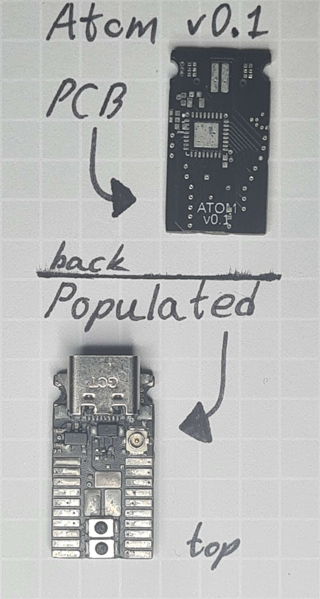
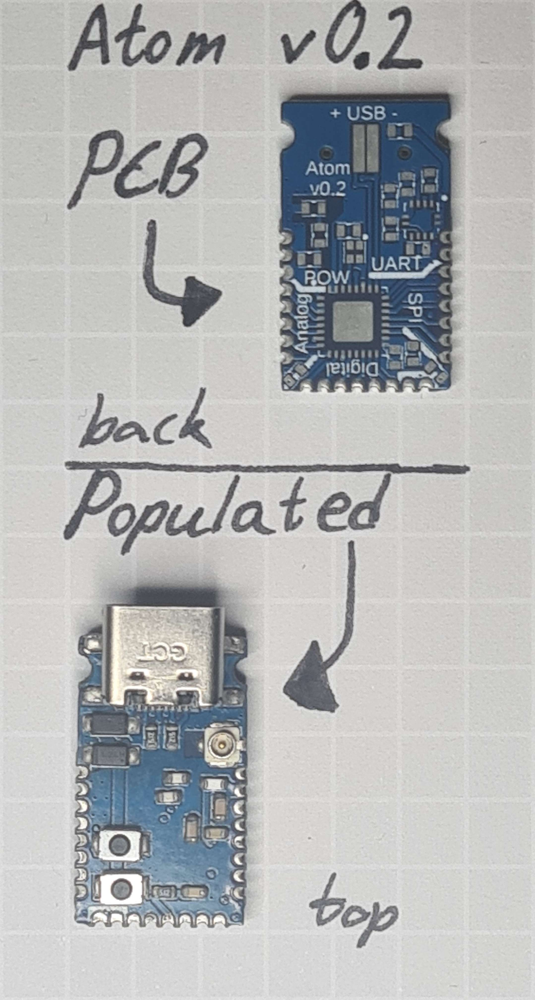
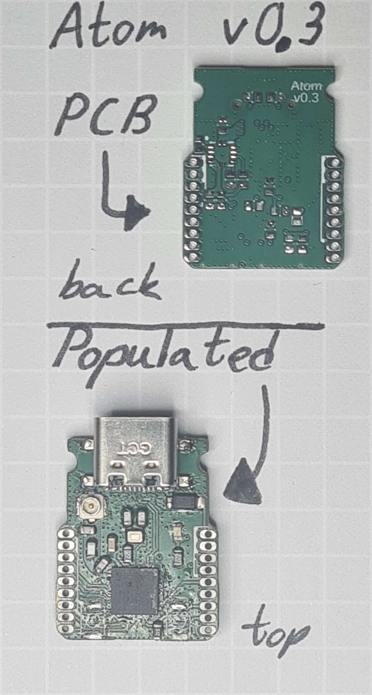

# ATOM project
## About
The project started as a learning exrecice to make a tiny some what low power esp32.
The MCU thet was selected for it was the ESP32-C3FH4 with 4MB of built in flash and a total of 22 GPIO pins.
More info about components are under each versions directrory since most componens differ.
## Goals
- max size 1" x 0.75"
- < 500 mA peak
- < 5 mA deep sleep
- External antenna (U.Fl connector)
- USB-C (For flashing and powering.)
- 1s li-ion or lipo powered
- GPIO
  - min 4 Digital
    - SPI
    - I2C (IIC)
  - min 2 Analog

Some later goals are:
- max size 0.9" x 0.5" x 0.5"
- power LED (3.3v)
- lipo charging (Via USB-C.)

images:  
| v0.1                         | v0.2                         | v0.3                         |
|------------------------------|------------------------------|------------------------------|
|  |  |  |
 
